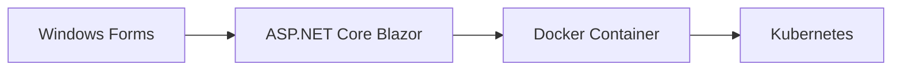

# Docker環境での実行ガイド

## 🐳 Docker対応について

このC# Windows Formsプロジェクトのコンテナ化には技術的な制約がありますが、複数のアプローチを提供しています。

## 📋 提供するDocker構成

### 1. 開発用データベース環境（最推奨）

**用途**: ローカル開発時にMySQLをコンテナで実行

```bash
# データベースのみ起動
docker-compose -f docker-compose.dev.yml up -d

# 接続確認
docker-compose -f docker-compose.dev.yml ps
```

**接続設定**:
```json
{
  "ConnectionStrings": {
    "DefaultConnection": "Server=localhost;Database=customer_management;User=customer_user;Password=customer_password;"
  }
}
```

### 2. コンソール版アプリケーション（推奨）

**用途**: Linux環境でのCRUDアプリケーション実行

```bash
# コンソール版起動
docker-compose -f docker-compose.console.yml up -d

# アプリケーションに接続
docker-compose -f docker-compose.console.yml exec customer_console bash
```

### 3. GUI環境（実験的・非推奨）

**用途**: Linux環境でのGUIアプリケーション実行（VNC経由）

⚠️ **注意**: Windows Formsの完全互換は困難です

```bash
# GUI環境起動（問題が発生する可能性が高い）
docker-compose up -d

# VNCでアクセス
# VNCクライアント: localhost:5901
# WebVNC: http://localhost:8080
```

## 🚀 セットアップ手順

### 開発用データベース環境

1. **Docker環境の準備**
   ```bash
   # Docker Desktop または Docker Engine がインストール済みであることを確認
   docker --version
   docker-compose --version
   ```

2. **データベース起動**
   ```bash
   cd /path/to/CustomerManager
   docker-compose -f docker-compose.dev.yml up -d
   ```

3. **データベース接続確認**
   ```bash
   # MySQLクライアントで接続テスト
   mysql -h 127.0.0.1 -P 3306 -u customer_user -pcustomer_password customer_management
   
   # または
   docker-compose -f docker-compose.dev.yml exec mysql-dev mysql -u customer_user -pcustomer_password customer_management
   ```

4. **アプリケーション実行**
   - Visual StudioでCustomerManager.WinFormsプロジェクトを実行
   - appsettings.jsonの接続文字列がlocalhostを指していることを確認

### コンソール版アプリケーション

1. **環境起動**
   ```bash
   docker-compose -f docker-compose.console.yml up -d
   ```

2. **アプリケーション実行**
   ```bash
   # インタラクティブモードでコンソールアプリに接続
   docker-compose -f docker-compose.console.yml exec customer_console dotnet CustomerManager.Console.dll
   
   # または直接実行
   docker run -it --network customer_network customer_console_app
   ```

3. **操作方法**
   - メニューから1-5を選択してCRUD操作を実行
   - 0で終了

### 完全コンテナ環境（上級者向け）

⚠️ **注意**: この構成は実験的で、Windows Forms完全互換ではありません

1. **環境起動**
   ```bash
   docker-compose up -d
   ```

2. **VNCアクセス**
   - VNCクライアント: `localhost:5901`
   - パスワード: `vncpassword`
   - または WebVNC: `http://localhost:8080`

## 📁 Docker関連ファイル

```
Answer/
├── docker-compose.yml              # 完全コンテナ環境
├── docker-compose.dev.yml          # 開発用データベースのみ
├── Dockerfile.linux-gui            # Linux GUI環境
├── Dockerfile.database-only        # データベースのみ
├── appsettings.docker.json         # Docker用設定
├── docker-scripts/
│   └── start-vnc.sh                # VNC起動スクリプト
└── docker-configs/
    └── mysql.cnf                   # MySQL設定
```

## ⚠️ 制約事項

### Windows Forms固有の問題

1. **GUI環境**: Windows FormsはデスクトップUIのため、コンテナ内実行は複雑
2. **プラットフォーム依存**: .NET 6でもWindows Forms部分はWindows/macOS限定
3. **パフォーマンス**: VNC経由のGUIは応答性が劣る

### 推奨される代替案

1. **開発環境**: データベースのみコンテナ化、アプリはローカル実行
2. **Web移植**: ASP.NET Core Blazorへの移植を検討
3. **API分離**: バックエンドAPIをコンテナ化し、フロントエンドは別途構築

## 🛠️ トラブルシューティング

### データベース接続エラー

```bash
# コンテナログ確認
docker-compose -f docker-compose.dev.yml logs mysql-dev

# コンテナ内接続テスト
docker-compose -f docker-compose.dev.yml exec mysql-dev mysql -u root -prootpassword -e "SHOW DATABASES;"
```

### ポート競合

```bash
# 使用中のポート確認
netstat -an | grep 3306

# 別ポートでの起動
# docker-compose.dev.ymlの "3306:3306" を "3307:3306" に変更
```

### VNC接続問題（完全コンテナ環境）

```bash
# コンテナ内VNCプロセス確認
docker exec customer_management_app ps aux | grep vnc

# VNCログ確認
docker logs customer_management_app
```

## 📈 本番環境への発展

### 1. Web化推奨パス



### 2. マイクロサービス化

- フロントエンド: Blazor WebAssembly
- バックエンドAPI: ASP.NET Core Web API
- データベース: MySQL/PostgreSQL コンテナ

### 3. クラウドネイティブ

- Azure Container Instances
- AWS ECS/Fargate  
- Google Cloud Run

## 💡 学習ポイント

この Docker 対応を通じて学べること：

1. **コンテナ化の課題**: GUIアプリケーションの制約
2. **段階的移行**: データベース → API → フロントエンドの順序
3. **インフラ as Code**: docker-composeによる環境定義
4. **開発環境統一**: チーム開発での環境差異解消

---

**推奨**: 研修では開発用データベース環境（docker-compose.dev.yml）を使用し、アプリケーションはローカルで実行することを強く推奨します。